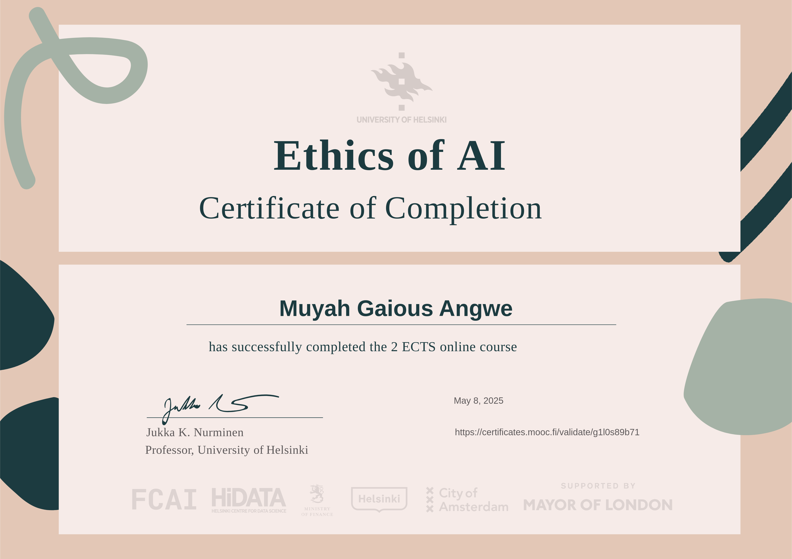

# Ethics of AI Certificate 🎓🤖

Welcome! I’ve just completed [The Ethics of AI](https://ethics-of-ai.mooc.fi/start) course by the University of Helsinki on the MOOC.fi platform and earned my certificate. This repository highlights key learnings, reflections, and project artifacts from the course.

---

## 📜 Certificate

---

## 📚 Course Overview

- **Institution:** University of Helsinki (MOOC.fi)  
- **Duration:** Self-paced, ~3–5 hours per chapter  
- **Core Topics:**
  - Ethical theories (utilitarianism, deontology, virtue ethics)
  - AI transparency, accountability, and non-maleficence
  - Fairness, bias mitigation, and human rights in AI
  - Practical case studies and hands-on exercises

---

## ✨ Key Takeaways

1. **Non-maleficence:** Identifying and preventing harm in AI systems  
2. **Transparency:** The importance of explainability and “black-box” challenges  
3. **Fairness & Bias:** Techniques to detect and mitigate discrimination  
4. **Accountability:** Assigning responsibility when AI causes harm  
5. **Ethical Frameworks:** Applying deontology, utilitarianism, and virtue ethics to real-world scenarios

---

## 📝 Reflections

> “This course sharpened my ability to critically evaluate AI impacts on society and equipped me with actionable frameworks to build more responsible systems.”

---

## 🚀 Next Steps

- Apply ethical checklists to current AI projects  
- Share insights in team workshops and study groups  
- Explore further courses: “Elements of AI” and “Building AI” by Helsinki  

Thank you for visiting! Feel free to reach out or collaborate on ethical AI initiatives.

